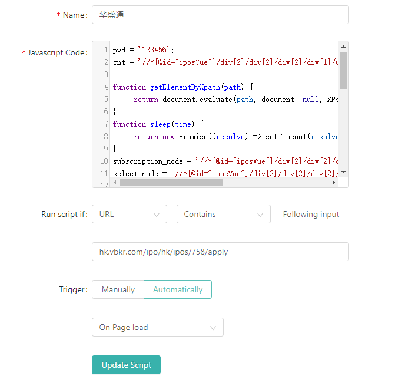
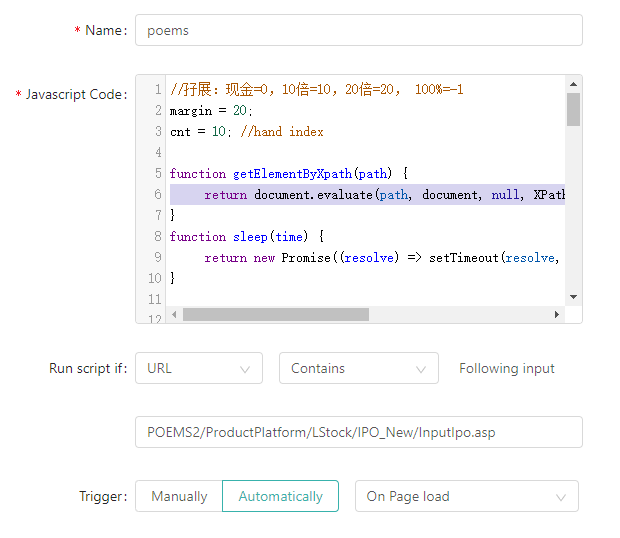
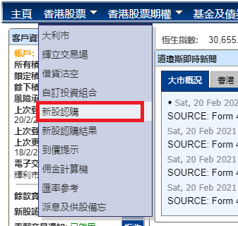

## 华盛通

### 准备

1. 预先打开好页面，必须拿chrome打开 

     比如：心通医疗
     https://hk.vbkr.com/ipo/hk/ipos/758/apply

     

2. 填好密码和多少手  
   
   * 打开`vbkr.js`
   
   * 替换上面的123456为自己的密码
   
   * `cnt`变量中最后的`li[X]`,  `X` 表示认购数量对应的位置号（索引从1开始），看自己的额度适当修改。
   
     > 另一个方法：获得目标选项的`XPath`,替换`cnt`变量的内容。
   
3. Chrome中安装 `Scripty`

    > https://chrome.google.com/webstore/detail/scripty-javascript-inject/milkbiaeapddfnpenedfgbfdacpbcbam?hl=en

4. 使用`Scripty`创建自动脚本

    **注意**：
    
    * 将修改好的`vbkr.js`，填入到下面的`javascript code` 中。
    * 条件URL，为目标网页的URL，同时将`https://`去掉。
    * 如需要最后手动确认，只需要将`vbkr.js` 中的`document.getElementById("jq_btn_ok").click();`删掉。
    
    

5. 打开目标网页

    在未满足条件的情况下，网页会自动刷新，直到抢购成功。

## 辉立

1. Chrome中安装 `Scripty`

   > https://chrome.google.com/webstore/detail/scripty-javascript-inject/milkbiaeapddfnpenedfgbfdacpbcbam?hl=en

2. 使用`Scripty`创建自动脚本

   打开编辑器打开`phillip.js`，编辑变量：

   * `margin` ： 用数字表示，其意义为：`现金=0，10倍=10，20倍=20，100%=-1 优先20倍，次之10倍=30`
   * `cnt`: 要打股票数量索引号，“请选择股数" 为0，下面数值顺序增1

   将修改好的`phillip.js`，填入到`Scripty`

   关键参数：

   * match 的URL：`POEMS2/ProductPlatform/LStock/IPO_New/InputIpo.asp`
   * Trigger: `Automatically`, `On Page Load`

   效果如下：

   

3. 打开目标网页

   登录进入到辉立的交易网页后，点击`香港股票`，此时出现下拉菜单，

   鼠标移至`新股认购`，**同时按住`Ctrl`键**,单击，浏览器打开新的网页，我们在这个新的网页上工作。

   > `Ctrl`键进新网页，这一步很关键！！！

   

接着就是Next...

当网页进到最终的新股认购网页后，脚本将会自动填入预设的内容并点击`提交`。

当条件不符合要求，将会自动刷新，直到成功。

## 华泰

网页版失效

## 方德

网页版失效

